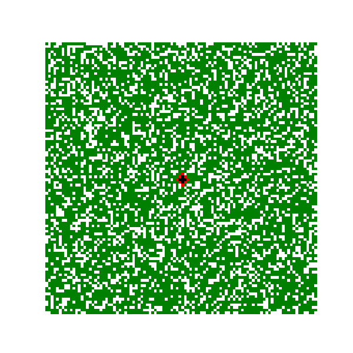
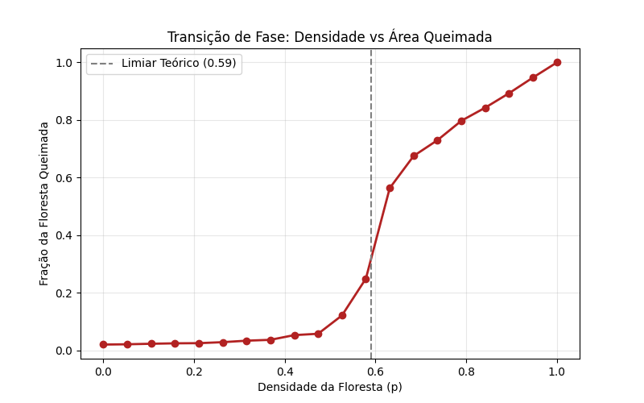

# 🔥 Simulação de Incêndio Florestal & Regeneração (Autômatos Celulares)

Projeto desenvolvido no **Google Colab** para a disciplina de **Computação Biológica (UFRPE)**. Implementação de um modelo estocástico para simular a dinâmica de queimadas e sucessão ecológica, demonstrando o fenômeno de **Transição de Fase** e **Percolação**.

## 🎥 Demonstração

## 📊 Resultados e Criticalidade

A simulação confirma o limiar crítico de percolação ($\rho_c \approx 0.59$). Abaixo disso, o fogo se extingue; acima, consome a floresta inteira (Cluster Gigante).

## 🚀 Como Rodar

O código foi desenvolvido em Jupyter Notebook. 
1. Acesse o arquivo `[Floresta_Autômatos_Celulares].ipynb` neste repositório.
2. Clique no botão "Open in Colab" (se aparecer) ou baixe para rodar localmente.

Dependências:
* Numpy
* Matplotlib

## 📄 Artigo Científico

O relatório técnico completo segue as normas exigidas e explica a correlação com o **Tipping Point da Amazônia**.

---
**Autor:** Hivison Santos Silva
